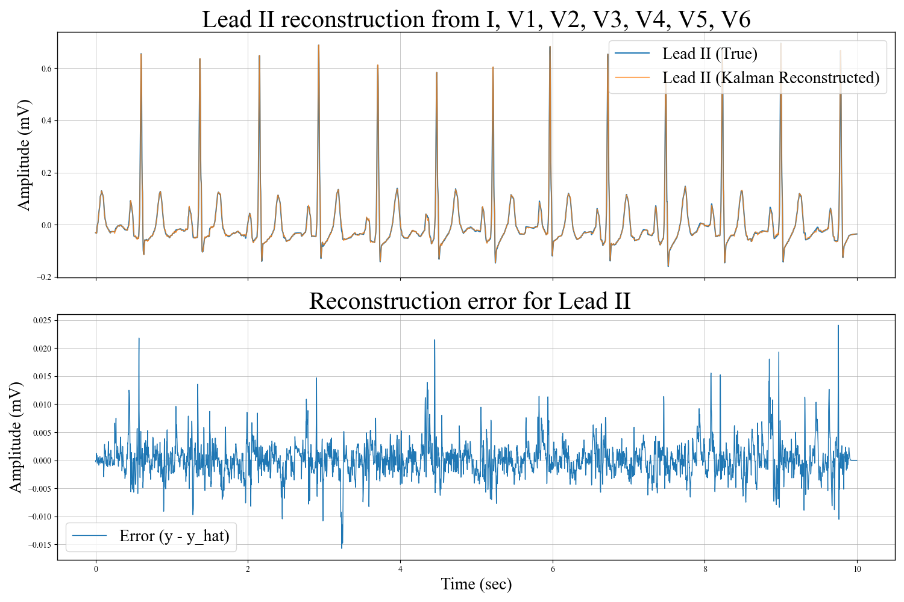
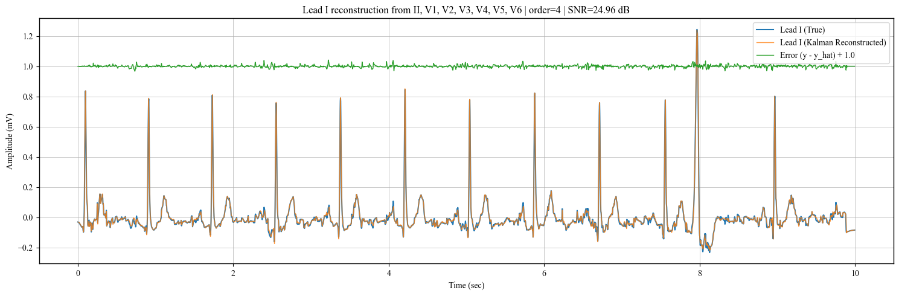
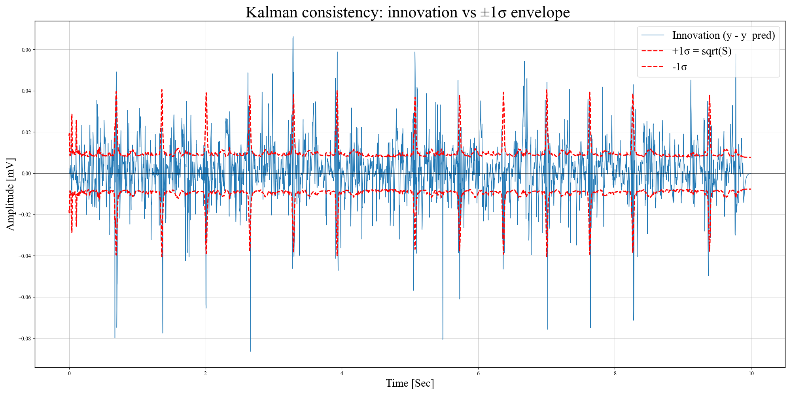
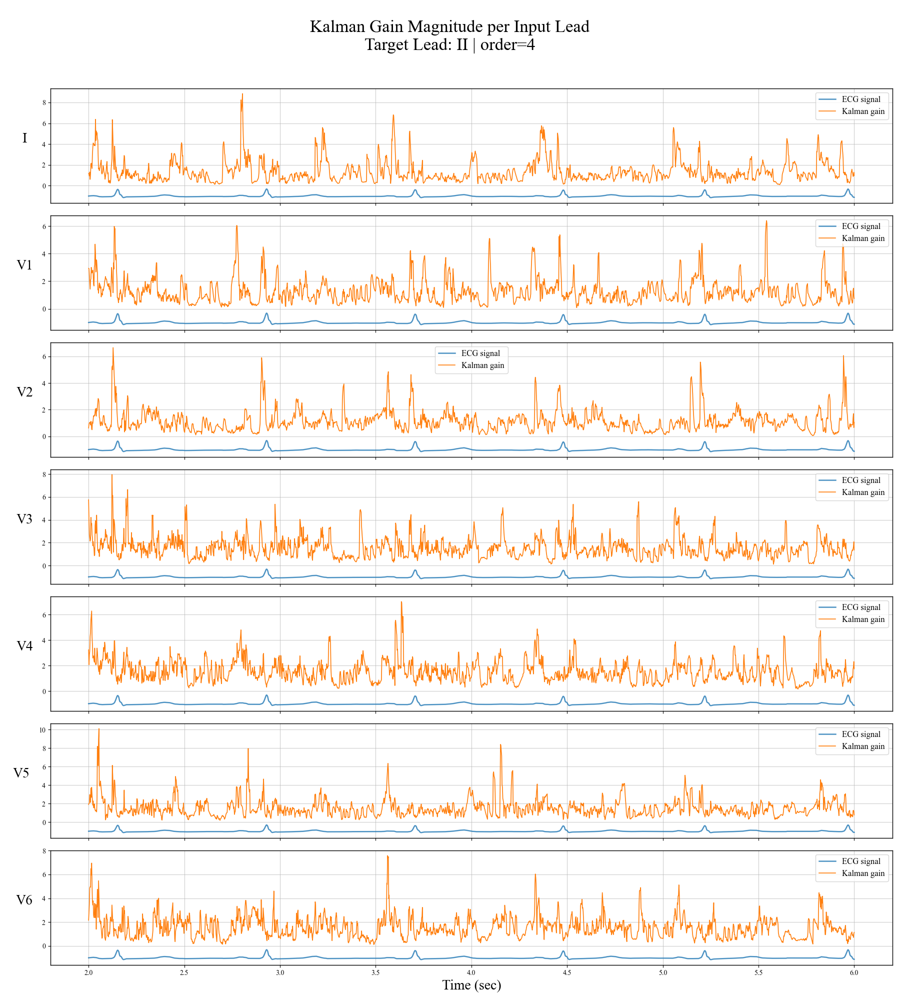
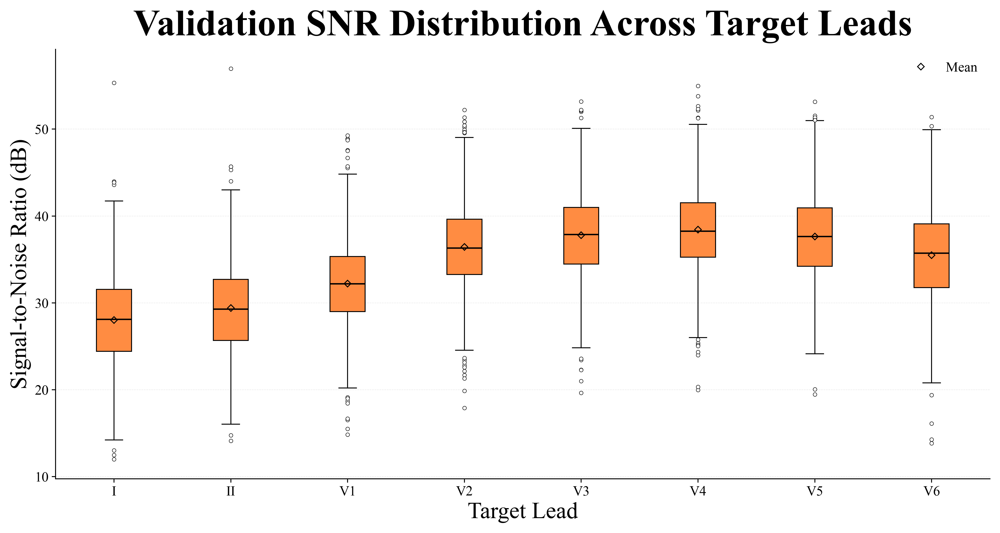

# ECG Lead Reconstruction Using Kalman FIR Filtering

This repository implements an **adaptive Kalman filter–based FIR framework** for reconstructing missing ECG leads from a reduced set of available leads. The method models **time-varying inter-lead relationships**, enabling physiologically interpretable and noise-aware ECG synthesis.

The framework is evaluated on the **PTB-XL dataset** using both single-lead and multi-lead reconstruction scenarios. Performance is quantified using **signal-to-noise ratio (SNR)** and supported by innovation consistency and Kalman gain analysis.

## Repository Contents

- `code1_specified_leads.ipynb`  
  include single lead - single lead analysis. Includes reconstruction examples, innovation analysis, and Kalman gain visualization.

- `code2_all_leads.ipynb`  
  include multi-lead reconstruction experiments used to analyze inter-lead redundancy and SNR distributions.

- `ecg_utils.py`  
  Utility functions for PTB-XL loading, preprocessing, and SNR computation.

- `outputs/`  
  Generated figures used for analysis and visualization.

## Outputs Overview

### Reconstruction Results

  

True vs reconstructed ECG signals showing preserved P–QRS–T morphology and low reconstruction error.

### Innovation Analysis

  

Innovation histogram demonstrates near-Gaussian behavior, while the innovation sequence with ±1σ bounds confirms Kalman filter consistency.

### Kalman Gain Analysis

Time-varying Kalman gain magnitude per input lead, highlighting adaptive weighting during high-information intervals such as QRS complexes.

### SNR Distributions

Boxplots of reconstruction SNR across ECG leads, revealing redundancy patterns consistent with cardiac anatomy.

## Key Takeaways

- Adjacent precordial leads exhibit high mutual predictability  
- Limb leads retain more unique information  
- Kalman FIR filtering provides an interpretable and adaptive alternative to static or purely data-driven methods  

## Applications

- Reduced-lead and wearable ECG systems  
- ECG compression and transmission  
- Interpretable biomedical signal processing
